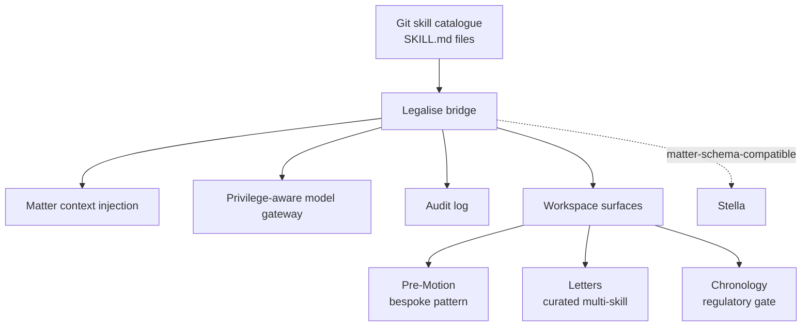
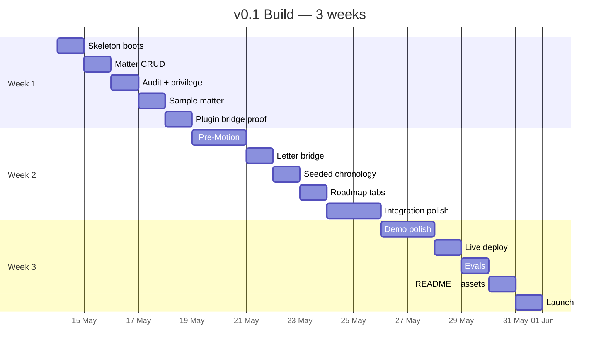

# Legalise

**Legalise turns reviewable legal skills into audited matter workflows.**

Legal AI work should be inspectable, composable, auditable, and run against
matter-shaped context instead of loose chat prompts. Legalise is the
execution substrate: a Git-distributed catalogue of `SKILL.md` files
rendered into a matter-first workspace for England & Wales legal work.
Every model call is audited, privilege posture is enforced at dispatch
time, and disclosure-tainted chronology entries are gated behind a
CPR 31.22 acknowledgement.

Skills come from [`claude-for-uk-legal`](https://github.com/b1rdmania/claude-for-uk-legal)
by default. Fork the catalogue, review skill changes by PR diff, point
Legalise at the approved SHA. Approval is code review. Provenance is git
history.

What we believe and refuse to do is in [`MANIFESTO.md`](./MANIFESTO.md).

Live demo target: [`legalise.dev`](https://legalise.dev). Installed skills
view: [`legalise.dev/#/modules`](https://legalise.dev/#/modules).

## What this is



v0.1 proves the execution layer and one coherent sample-matter workflow:
matter context, audit logging, privilege posture, local/cloud model routing,
Pre-Motion, Letters, chronology with CPR 31.22 gating, and a read-only
installed-skills catalogue.

It runs locally via Docker Compose or live at `legalise.dev` (Fly.io `lhr`
backend + Neon London Postgres + Cloudflare R2 in EU placement — **not**
UK-residency end-to-end; see [`docs/TRUST.md`](./docs/TRUST.md)).

## Status (May 2026)

Shipped in the repo:

- FastAPI backend with Postgres, audit middleware, privilege-aware model gateway, plugin bridge, and module endpoints
- React 19 + Vite frontend with landing, matter workspace, module surfaces, and installed-skills discovery
- Docker Compose stack: Postgres + pgvector, MinIO, Redis, Gotenberg, Ollama profile, backend, frontend
- `claude-for-uk-legal` skill catalogue vendored into the Fly image at a pinned SHA
- Evals for sample-matter audit shape and letter catalogue routing
- Honest trust documentation in [`docs/TRUST.md`](./docs/TRUST.md)

## Stack

- Backend: Python 3.12 + FastAPI, SQLAlchemy 2 + Alembic, async Anthropic SDK
- Database: PostgreSQL 16 + pgvector
- Frontend: React 19 + Vite + TanStack Router, Tailwind + Shadcn primitives
- AI: model gateway abstracting Anthropic, OpenAI, Ollama (per-matter privilege posture selects provider)
- Storage: MinIO (S3 API), Gotenberg (HTML→PDF), LibreOffice headless (DOCX)
- Hosting (live): Cloudflare Pages + Fly.io `lhr` + Neon London + Cloudflare R2. UK-region database and backend; edge CDN and storage at EU / Western Europe placement. See [`infra/deploy/cloudflare.md`](./infra/deploy/cloudflare.md).
- Hosting (self): Docker Compose

Stack rationale in `ARCHITECTURE.md`.

## Installing skills

Legalise treats Git as the marketplace. Firms approve prompt changes the way
they approve code: fork, review, merge, pin, deploy.

```bash
# Fork claude-for-uk-legal, or any catalogue of SKILL.md files.
gh repo fork b1rdmania/claude-for-uk-legal

# Review skills by PR diff. Approve through the firm's normal process.
# ...internal code review...

# Point Legalise at the approved catalogue version.
export PLUGINS_REPO=https://github.com/<your-org>/claude-for-uk-legal
export PLUGINS_REPO_REF=<your-approved-sha>

# Self-host
export PLUGINS_HOST_PATH=/path/to/your/approved/catalogue
docker compose -f infra/docker-compose.yml up --build

# Live demo / Fly image path
cd backend
fly deploy
```

The installed catalogue is visible at `#/modules` in the app. The page reads
`PLUGINS_ROOT`, groups skills by plugin, links to the pinned source blob, and
shows the prompt body that an internal tech team would review.

## Module surfaces

Skills are the executable units. Surfaces are how those skills show up in the
workspace. v0.1 proves three patterns; Pre-Motion, Letters, and Chronology are
the canonical demonstrations — not the project's identity.

| Pattern | Canonical demonstration | What it proves |
|---|---|---|
| Generic invocation | `POST /api/matters/{slug}/invoke` | Any installed skill can run with matter context and audit rows |
| Curated multi-skill | Letters | A workspace section can route among several skills by matter type |
| Bespoke orchestration | Pre-Motion | A surface can fan out across multiple calls (4 stages, 9 model calls) while still going through the same gateway and audit log |

Chronology is a regulatory surface over seeded data. Contract Review is visible
as a v0.2 roadmap surface only.

The project is the execution substrate. The four surfaces are proof modules.
New surfaces follow the same three patterns; nothing about a surface is
load-bearing for the workspace shape.

## The plan in one page



## Skills-and-workspace relationship

Legalise composes skills from the [`claude-for-uk-legal`](https://github.com/b1rdmania/claude-for-uk-legal) suite. The skills ship as a standalone repo so they can be used independently with Claude Code. The workspace adds matter context, audit logging, privilege awareness, document handling, discovery, and a UI.

| Layer | What it is | Where |
|---|---|---|
| Catalogue | Markdown `SKILL.md` files — pure legal logic, no UI | `claude-for-uk-legal` repo or your fork |
| Workspace | FastAPI + React, matter-first, audit + privilege + local-model scaffolding | `legalise` repo (this one) |
| Bridge | Adapter that invokes skills with matter context | `backend/app/adapters/plugin_bridge.py` |
| Discovery | Read-only installed-skills view over `PLUGINS_ROOT` | `GET /api/modules`, `#/modules` |

## What this isn't

- A production legal tool. v0.1 is a demo with substance, not something a regulated practice runs live matters on.
- Legal advice software. Every output is a draft for solicitor review.
- US, Scotland, or NI workflows.

## What v0.1 does not yet do

The execution layer and the catalogue shape are real. The module *lifecycle*
is not. v0.2 turns the discovery surface into a real lifecycle. None of the
following exist in v0.1:

- **Install / enable toggles per workspace.** Every skill under `PLUGINS_ROOT` is loadable. There is no on/off per workspace.
- **Per-workspace module policy.** No "this skill is allowed on ET matters, blocked on civil" lever.
- **Module permissions.** Modules cannot scope what they read or write — they get the full module-SDK surface.
- **UI contracts for modules.** Module manifests describe nav and routes; they don't constrain markup, theme, or layout. A hostile module can render anything.
- **Signed manifests / skill provenance attestation.** Provenance today is "the git SHA of the catalogue fork you pinned". No author signatures, no organisation-level trust roots.
- **Quality and lint gates for skills.** A SKILL.md can ship anything — prompt-injection, jailbreaks, sloppy markdown. No automated scan, no required schema beyond name + description.

Each gap is intentional v0.1 restraint, not oversight. See [`ROADMAP.md`](./ROADMAP.md) for which v0.2 work picks each one up.

## Extending the workspace

Legalise is an audited execution layer first. The app is also module-extensible:
teams can add new workspace surfaces that read matter context, call the model
gateway, invoke installed skills, and render output in the matter view.

A module is a self-contained backend + frontend pair that plugs into the
matter spine. Internal law firm forks can add private surfaces without pushing
upstream. That is separate from installing skills, which is Git catalogue
management via `PLUGINS_ROOT`.

| Resource | What it is |
|---|---|
| [`docs/MODULE_DEVELOPMENT.md`](./docs/MODULE_DEVELOPMENT.md) | Five steps to ship a module |
| [`schemas/module.json`](./schemas/module.json) | Manifest JSON Schema |
| [`examples/modules/example-tab/`](./examples/modules/example-tab) | Minimal copy-paste starter |
| [`backend/app/core/api.py`](./backend/app/core/api.py) | Stable public surface modules import |

## Trust & security

The regulatory shape of a UK legal AI workspace — privilege architecture,
CPR 31.22 gate, sub-processor list, audit posture, compliance order
(Cyber Essentials Plus → ISO 27001 → SOC 2) — is documented in
[`docs/TRUST.md`](./docs/TRUST.md). It is the v0.1 source of truth and
gets published as `legalise.dev/trust` in v0.2. Open questions and gaps
are listed honestly there rather than papered over.

## Reviewers

If you're reviewing the plan, start with:

1. [`EXECUTIVE_SUMMARY.md`](./EXECUTIVE_SUMMARY.md) — what this is and why
2. [`SCOPE.md`](./SCOPE.md) — in / out / decision log
3. [`ARCHITECTURE.md`](./ARCHITECTURE.md) — technical decisions
4. [`BUILD_PLAN.md`](./BUILD_PLAN.md) — week-by-week
5. [`REGULATORY_PLUMBING.md`](./REGULATORY_PLUMBING.md) — UK-specific design choices
6. [`ROADMAP.md`](./ROADMAP.md) — v0.2 → v0.5+

The plan should be stress-tested against:

- Stack choices (Python / FastAPI / React vs. TypeScript / Bun alternatives)
- Module scope (the three surface patterns hold? Pre-Motion is the right canonical demonstration of the bespoke pattern?)
- Regulatory plumbing visibility (is the demo-grade implementation defensible or theatrical?)
- Stella interop strategy (data-schema match enough, or does it need code-level interop?)
- Three-week timeline (achievable solo, or fantasy?)

Critique is the point. Sycophancy not useful.

## Disclaimer

This repository will provide software tools that may assist in the production of legal work-product. It does not provide legal services or legal advice. The workspace and plugins are designed to be used by qualified lawyers under their professional supervision. Use by non-lawyers in a regulated legal context may breach the Legal Services Act 2007 and the SRA Standards and Regulations.

## Licence

Apache-2.0. See [LICENSE](./LICENSE).

## Maintainer

[@b1rdmania](https://github.com/b1rdmania)
