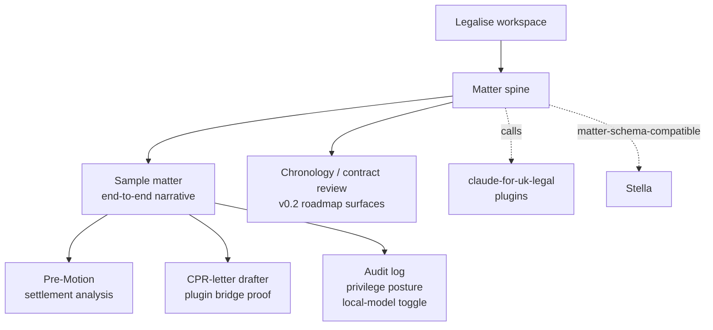
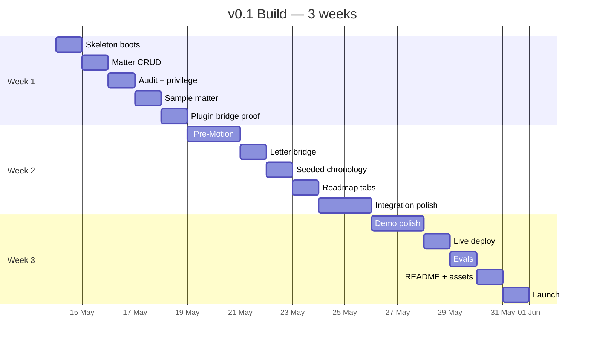

# Legalise

UK-native legal AI workspace for England & Wales. Matter-first. Privilege-preserving. Open-source. Designed to be extended.

Built on top of the [`claude-for-uk-legal`](https://github.com/b1rdmania/claude-for-uk-legal) plugin suite. New tabs plug into the matter spine via a documented module SDK — see [`docs/MODULE_DEVELOPMENT.md`](./docs/MODULE_DEVELOPMENT.md). The SDK primitives (`app.core.api`, manifest schema, example module) are in place at the planning level; their concrete implementations land during the v0.1 build window.

> **Pre-build scaffold.** This repo currently contains the plan and skeleton only — the v0.1 build kicks off shortly. See [`EXECUTIVE_SUMMARY.md`](./EXECUTIVE_SUMMARY.md), [`BUILD_PLAN.md`](./BUILD_PLAN.md), [`ARCHITECTURE.md`](./ARCHITECTURE.md), [`SCOPE.md`](./SCOPE.md), [`ROADMAP.md`](./ROADMAP.md), and [`REGULATORY_PLUMBING.md`](./REGULATORY_PLUMBING.md) for the full plan. Reviewers welcome.

## What this will be

One coherent sample-matter workflow around a matter spine. v0.1 proves the workspace shape: matter context, audit logging, privilege awareness, local/cloud model routing, Pre-Motion settlement analysis, and one real `claude-for-uk-legal` plugin invocation. Chronology and contract review remain visible roadmap surfaces rather than launch commitments. Workspace runs locally via Docker Compose or live at `legalise.dev` (deployed in UK region for data residency).

## Pre-build status (May 2026)

The repository contains:

- Full planning documentation
- Directory skeleton for backend (FastAPI), frontend (React 19), infrastructure
- Schema definitions (matter schema compatible with [Stella](https://github.com/stella/stella))
- `infra/docker-compose.yml` for the full stack (Postgres + pgvector, MinIO, Redis, Gotenberg, Ollama)
- Empty module scaffolds ready to receive the v0.1 implementation

Build kicks off Week 1, target three weeks to v0.1 launch with a fourth-week stretch buffer.

## Stack

- Backend: Python 3.12 + FastAPI, SQLAlchemy 2 + Alembic, async Anthropic SDK
- Database: PostgreSQL 16 + pgvector
- Frontend: React 19 + Vite + TanStack Router, Tailwind + Shadcn primitives
- AI: model gateway abstracting Anthropic, OpenAI, Ollama (per-matter privilege posture selects provider)
- Storage: MinIO (S3 API), Gotenberg (HTML→PDF), LibreOffice headless (DOCX)
- Hosting (live): Azure UK South or AWS eu-west-2 (UK data residency)
- Hosting (self): Docker Compose

Stack rationale in `ARCHITECTURE.md`.

## The plan in one page

## Plugins-and-workspace relationship

Legalise composes plugins from the [`claude-for-uk-legal`](https://github.com/b1rdmania/claude-for-uk-legal) suite. The plugins ship as a standalone repo so they can be used independently with Claude Code or Claude Cowork. The workspace adds matter context, audit logging, privilege awareness, document handling, and a UI.

| Layer | What it is | Where |
|---|---|---|
| Plugins | Markdown SKILL.md files + plugin.json — pure legal logic, no UI | `claude-for-uk-legal` repo |
| Workspace | FastAPI + React, matter-first, audit + privilege + local-model scaffolding | `legalise` repo (this one) |
| Plugin bridge | Adapter that lets workspace modules invoke plugin skills with matter context | `backend/app/adapters/plugin_bridge.py` |

## What this isn't

- A production legal tool. v0.1 is a demo with substance, not something a regulated practice runs live matters on.
- Legal advice software. Every output is a draft for solicitor review.
- US, Scotland, or NI workflows.

## Extending

Legalise is a platform. The five v0.1 modules are the starting set — anyone can add their own.

A module is a self-contained backend + frontend pair that plugs into the matter spine. Reads matter context, calls the model gateway with audit logging built in, invokes plugin skills, renders output in the matter view. Internal law firm forks can add private modules without ever pushing upstream.

| Resource | What it is |
|---|---|
| [`docs/MODULE_DEVELOPMENT.md`](./docs/MODULE_DEVELOPMENT.md) | Five steps to ship a module |
| [`schemas/module.json`](./schemas/module.json) | Manifest JSON Schema |
| [`examples/modules/example-tab/`](./examples/modules/example-tab) | Minimal copy-paste starter |
| [`backend/app/core/api.py`](./backend/app/core/api.py) | Stable public surface modules import |

## Reviewers

If you're reviewing the plan, start with:

1. [`EXECUTIVE_SUMMARY.md`](./EXECUTIVE_SUMMARY.md) — what this is and why
2. [`SCOPE.md`](./SCOPE.md) — in / out / decision log
3. [`ARCHITECTURE.md`](./ARCHITECTURE.md) — technical decisions
4. [`BUILD_PLAN.md`](./BUILD_PLAN.md) — week-by-week
5. [`REGULATORY_PLUMBING.md`](./REGULATORY_PLUMBING.md) — UK-specific design choices
6. [`ROADMAP.md`](./ROADMAP.md) — v0.2 → v0.5+

The plan should be stress-tested against:

- Stack choices (Python / FastAPI / React vs. TypeScript / Bun alternatives)
- Module scope (five is the right number? Pre-Motion is the right hero?)
- Regulatory plumbing visibility (is the demo-grade implementation defensible or theatrical?)
- Stella interop strategy (data-schema match enough, or does it need code-level interop?)
- Three-week timeline (achievable solo, or fantasy?)

Critique is the point. Sycophancy not useful.

## Disclaimer

This repository will provide software tools that may assist in the production of legal work-product. It does not provide legal services or legal advice. The workspace and plugins are designed to be used by qualified lawyers under their professional supervision. Use by non-lawyers in a regulated legal context may breach the Legal Services Act 2007 and the SRA Standards and Regulations.

## Licence

Apache-2.0. See [LICENSE](./LICENSE).

## Maintainer

[@b1rdmania](https://github.com/b1rdmania)
