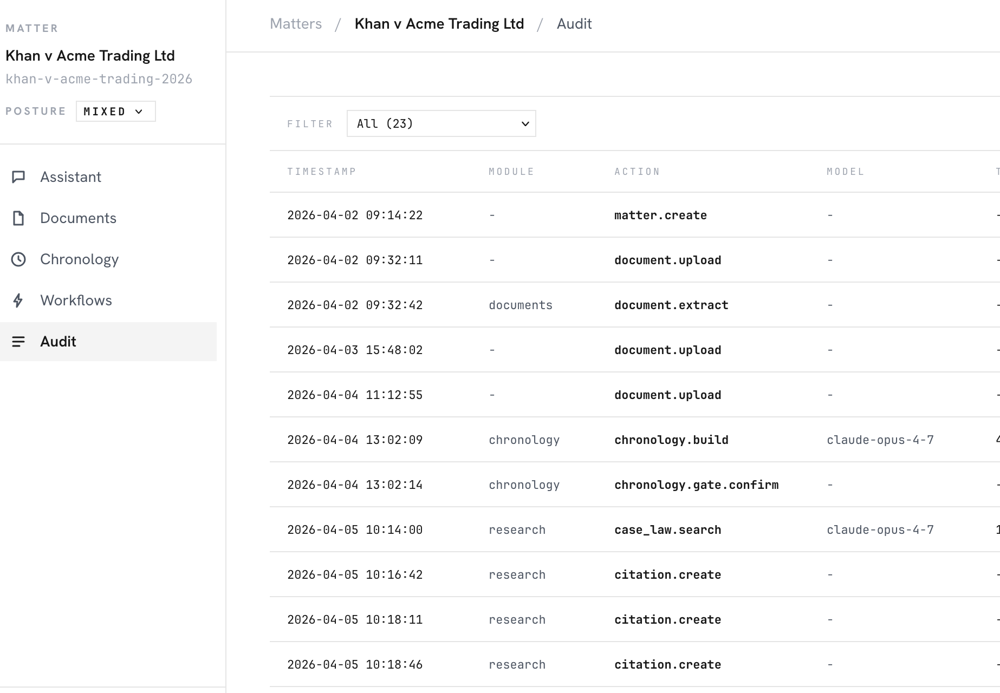

# Legalise

UK legal AI workspace. Built for the regulator, not the demo.

Open source, Apache 2.0. England & Wales. `v0.1`. Hosted demo at [legalise.dev](https://legalise.dev) shipping Friday.



---

A regulator will eventually ask four questions about any AI tool used on a matter:

1. What did it see?
2. When?
3. Under what protection?
4. What did it produce?

Most legal AI tools answer one of them, badly. Legalise answers all four by default.

---

## What did it see?

Every matter has a spine: documents, chronology, parties, retention clock, privilege posture. The AI only sees what lives inside the matter. Cross-matter leakage is structurally impossible.

Disclosure-tainted chronology entries carry a CPR 31.22 implied-undertaking flag. The chronology gate refuses cross-matter use. The refusal is audited.

## When?

Every model call, document mutation, chronology entry, and capability denial writes one row to an append-only audit log. Timestamped, hashed, tied to the matter and the actor. The Audit tab is the regulator-facing record.

No background calls. No invisible inference. If it touched the matter, it's logged.

## Under what protection?

Every matter carries one of three privilege flags.

- `A_cleared`: privileged material excluded or cleared. Cloud providers permitted.
- `B_mixed`: opt-in per provider. Default for most matters.
- `C_paused`: privileged material present or unresolved. Cloud calls refused at the gateway. Local model only (Ollama).

The gateway reads the posture before every model call. Privilege is a hard dispatch constraint, not a checkbox.

## What did it produce?

Prompt and response are hashed and stored. So is the model, the tokens, the latency, the posture, the module that made the call. Any AI interaction on the matter can be reconstructed forensically.

Capabilities for each module are declared in the manifest (read documents, call the model, write citations, etc.), granted on install, and checked at runtime before every privileged operation. A denial is a structured 403 plus an audit row.

The doctrine:

> Manifest requests capabilities. Workspace grants capabilities. Runtime enforces capabilities.

---

## v0.1 in 60 seconds

Five surfaces inside the matter workspace:

- **Pre-Motion.** Adversarial premortem of a draft pleading. Four stages, nine model calls, one audited run.
- **Contract Review.** Parser, analyst, redliner, summariser pipeline. Streams stage events.
- **Letters.** LBA and matter-shaped letters from context. `.docx` export.
- **Anonymisation.** Presidio + deterministic token map. Detokenise byte-identical.
- **Assistant.** Matter-scoped chat with document and chronology citations.

Plus tracked-changes document editing, tabular review across documents, case-law citation lookup.

The plugin layer (where the legal logic actually lives) is at [`claude-for-uk-legal`](https://github.com/b1rdmania/claude-for-uk-legal). 15 skills across UK employment law, civil litigation, and legal research. Apache 2.0. Pinned by SHA so the install surface is reproducible.

## Try it

The hosted demo at [legalise.dev](https://legalise.dev) goes live Friday. Khan v Acme sample matter will seed on signup. Until then, run it locally:

```bash
git clone https://github.com/b1rdmania/legalise
cd legalise
cp .env.example .env             # ANTHROPIC_API_KEY optional; stub-echo works without
docker compose -f infra/docker-compose.yml up --build
```

Postgres + pgvector + MinIO + Redis + Gotenberg + FastAPI + React. One command. Open `http://localhost:3000`.

## Status

v0.1. Honest about what's in and what isn't.

**Shipped:**

- Five surfaces wired end-to-end against the Khan v Acme matter
- Audit middleware on every model call and matter mutation
- Privilege-aware gateway across Anthropic, OpenAI, Ollama
- Runtime capability enforcement at five boundaries (plugin bridge, model gateway, tool invocation, document body read, citation writes)
- Tracked-changes editing with accept / reject and version timeline
- fastapi-users cookie sessions, email verification, per-user AES-256-GCM-encrypted provider keys
- Bootstrap audit rows on per-user seed so the Audit tab is non-empty on first paint
- Real-DB E2E test infrastructure; 155 passed, 53 skipped in backend CI

**v0.2:**

- Job runner (`arq` + Redis + `jobs` table). Long runs still use router-local `asyncio.create_task`.
- TanStack Router / Query migration
- Provider-native structured output and tool calling
- Docx templates for Pre-Motion and Contract Review
- Multi-instance Redis-backed rate limiter
- Chronology-write capability wiring when the endpoint lands

**v0.3+:**

- Matter export / import with privilege-aware redaction matrix

Full roadmap: [`docs/ROADMAP.md`](./docs/ROADMAP.md).

## Read deeper

- [`docs/MANIFESTO.md`](./docs/MANIFESTO.md): commitments that don't move
- [`docs/TRUST.md`](./docs/TRUST.md): privilege architecture, sub-processor list, open gaps
- [`ARCHITECTURE.md`](./ARCHITECTURE.md): stack rationale and decisions
- [`docs/ENGINEERING.md`](./docs/ENGINEERING.md): bespoke vs boring; what's custom, what's stock
- [`docs/AUTH.md`](./docs/AUTH.md): auth and provider-key model
- [`docs/MODULE_DEVELOPMENT.md`](./docs/MODULE_DEVELOPMENT.md): write a new module
- [`docs/ATTRIBUTIONS.md`](./docs/ATTRIBUTIONS.md): library credits and licence notes

## Caveat

This is software that helps produce legal work-product. It is not legal advice. The workspace and modules are designed for qualified solicitors under their professional supervision. Use by non-lawyers in a regulated legal context may breach the Legal Services Act 2007 and the SRA Standards and Regulations.

## Licence

Apache 2.0. See [LICENSE](./LICENSE).

## Maintainer

[@b1rdmania](https://github.com/b1rdmania). Open an issue. Or, if you're a UK solicitor wondering what your AI did with the client documents, get in touch.
